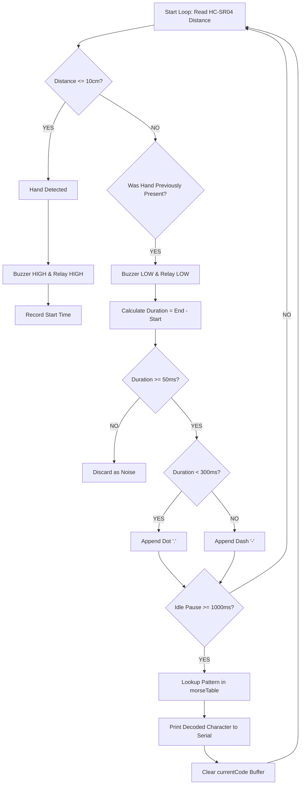

# 🪞 Periscope — Invisible Morse Code Generator

## Basic Details
### Team Name: Smart Boys

### Team Members
- Team Lead: Aaron Binoy - Saintgits College of Engineering
- Member 2: Abin Sunil - Saintgits College of Engineering

### Project Description
Periscope is a contactless, optical and auditory Morse code telecommunication device. Instead of pressing physical keys, users tap their hands through thin air in front of an ultrasonic sensor. The system processes hand proximity timing, translates short/long proximity breaks into Dots and Dashes, triggers a blinding 12V optical flash relay alongside a piezo audio signal, and outputs decoded text directly to a Serial Interface in real time.

### The Problem (that doesn't exist)
In an age saturated with ultra-fast 5G networks, messaging apps, and instant text delivery, humanity has lost the dramatic tension of waiting several minutes to send a single word. Physical buttons are far too tactile and reliable, while touchscreens lack the thrilling ambiguity of non-contact air gestures. Modern communications completely fail to incorporate high-voltage clicks and blinding optical signals for simple messages.

### The Solution (that nobody asked for)
Periscope fixes modern messaging over-convenience by forcing you to wave your hands like a mad scientist in front of an ultrasonic sensor to spell out messages character-by-character. By measuring hand proximity timing down to the millisecond, it triggers a loud 1-channel relay, flashes a 12V LED light array, sounds an audio buzzer, and decodes your gestures using embedded microcontrollers—delivering a blazing data throughput of roughly 2 words per minute.

---

## Technical Details
### Technologies/Components Used

For Software:
- C / C++ (Arduino Framework)
- C++ Data Structures (`struct` Array Mapping)

For Hardware:
- ESP32 Microcontroller (NodeMCU-32S / ESP-WROOM-32)
- HC-SR04 Ultrasonic Distance Sensor
- 1-Channel Relay Module (5V Coil / Active-HIGH Logic)
- Piezo Passive/Active Buzzer
- 12V LED Strip / Signage Light Array
- 9V / 12V External DC Battery
- Breadboard & Jumper Wires

---

### Implementation

For Software:

# Installation
1. Install [VS Code](https://code.visualstudio.com/) with the [PlatformIO IDE](https://platformio.org/) extension installed (or use the official [Arduino IDE](https://www.arduino.cc/en/software)).
2. Clone this repository to your local machine.

### Run
1.Connect the ESP32 to your PC via a USB cable.

2.Open the Serial Monitor set to 115200 Baud.

3.Place your hand within 10 cm of the ultrasonic sensor:

4.Quick Tap (<300ms): Registers a Dot (.)

4.Hold (≥300ms): Registers a Dash (-)

Pause 1 second: Decodes current symbol pattern into a letter

###Screenshots (Add at least 3)
### 

###PlatformIO / Arduino IDE configuration showing pin mappings and threshold configurations
### 
Demonstration of line-by-line Morse string parsing outputting decoded text

###Diagrams

### Schematic & Circuit

USB 5V Power Supply                    9V External Battery
       |                                         |
       +---> [ ESP32 Microcontroller ]           +---> [ Relay COM Terminal ]
                   |      |                                   |
    GPIO 5 (TRIG) -+      +-- VIN (5V) ---> [ Relay VCC ]     | (Switched Path)
    GPIO 18 (ECHO)-+      +-- GPIO 23 ----> [ Relay IN  ]     v
    GPIO 19 -------+---- [ Buzzer (+) ]                [ Relay NO Terminal ]
                          |                                   |
                          |                                   v
                          |                         [ 12V LED Strip (+) ]
                          |                                   |
                          v                                   v
             =======================================================
             COMMON GROUND RAIL  (ESP32 GND = 9V (-) = LED (-))
             =======================================================

### Build Photos

### Project Demo

https://github.com/user-attachments/assets/a8062817-a892-4da8-9685-bf0ada1f5137

### Additional Demos

https://github.com/user-attachments/assets/afbcb81c-4535-4076-bb88-56a7cd4be94d

### Team Contributions
Aaron Binoy: System architecture design, ESP32 microsecond pulse timing implementation, state-machine Morse decoding logic, hardware assembly, and debugging.

Abin Sunil: Hardware circuit wiring, relay-to-12V power path isolation, common ground bus integration, testing, and documentation.

---
Made with ❤️ at TinkerHub Useless Projects 

